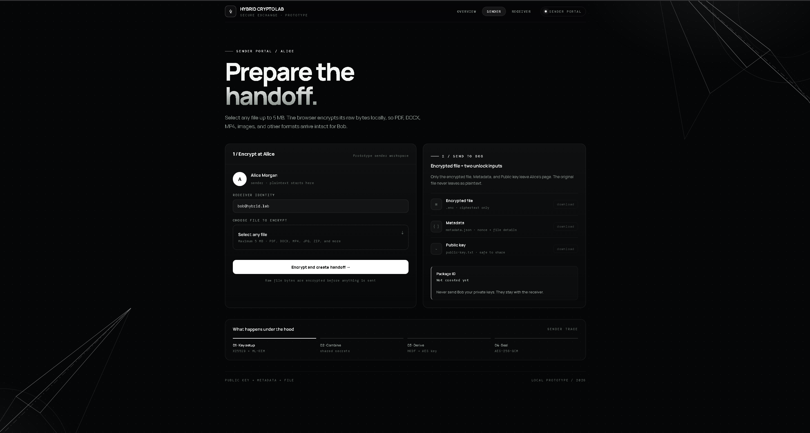

# Hybrid Elliptic-Curve Cryptography for Secure File Exchange

[](https://opensource.org/licenses/MIT)
[](https://www.python.org/downloads/)
[](https://pytest.org/)
[](https://github.com/psf/black)
[](https://owasp.org/)
[](https://github.com/ShreyasPSoori/Hybrid-Elliptic-Curve-Cryptography)

## Overview

An educational prototype demonstrating secure file exchange between two users by combining classical, post-quantum, and symmetric cryptography.

## Features

- **AES-256-GCM**: Fast file encryption with authenticated encryption
- **X25519**: Classical key agreement protocol
- **ML-KEM-768**: Post-quantum key encapsulation mechanism
- **HKDF-SHA256**: Secure key derivation combining multiple secrets
- **Two-user demonstration frontend**: Browser-based sender/receiver interface

## Quick Start

### Python Prototype

```powershell
# Create and activate virtual environment
python -m venv .venv
.venv\Scripts\Activate.ps1

# Install dependencies
pip install -r requirements.txt

# Run sender encryption
python hybrid_encrypt_v2.py

# Run receiver decryption
python hybrid_decrypt_v2.py
```

### Frontend Demonstration

Open `frontend/sender.html` or `frontend/receiver.html` in a browser to test the workflow without a server.

## Repository Structure

```
Hybrid-Elliptic-Curve-Cryptography/
|-- hybrid_encrypt_v2.py       # Sender-side hybrid encryption prototype
|-- hybrid_decrypt_v2.py       # Receiver-side hybrid decryption prototype
|-- hybrid_key.py              # Hybrid key experiments
|-- aes_test.py                # AES-GCM test
|-- x25519_test.py             # X25519 shared-secret test
|-- mlkem_test.py              # ML-KEM encapsulation test
|-- hybrid_kdf_test.py         # Hybrid KDF test
|-- requirements.txt           # Python dependencies
|-- input/
|   `-- sample.txt
`-- frontend/
    |-- index.html             # Role selector
    |-- sender.html            # Alice's file encryption page
    |-- receiver.html          # Bob's file decryption page
    |-- app.js                 # Frontend file and package logic
    `-- styles.css             # Shared frontend styling
```

## Testing

Run the component tests:

```powershell
python aes_test.py
python x25519_test.py
python mlkem_test.py
python hybrid_kdf_test.py
```

> **Note**: Tests require `input/sample.txt` and the `oqs` Python module with `liboqs` native library installed.

## Cryptographic Flow

1. Alice generates ephemeral X25519 keys and encapsulates ML-KEM using Bob's public key
2. Both secrets are combined via HKDF-SHA256 to derive the AES-256 key
3. File is encrypted with AES-256-GCM
4. Encrypted file + metadata sent to Bob
5. Bob reconstructs shared secrets using his private keys
6. AES key is derived and file is decrypted


## Screenshots

### Sender Side


### Receiver Side  

## Security Notes

- Never commit private keys, AES keys, shared secrets, credentials, or generated output files
- Never upload Bob's private keys with the encrypted file
- Use a KMS or equivalent protected key store for production deployment
- The current browser demonstration uses Web Crypto AES-GCM; production cryptography should use the reviewed Python backend

## Planned Extensions

1. Connect frontend to Python hybrid encryption service
2. Add SHA-256 file hashing and integrity comparison
3. Add protected key storage and key rotation through a KMS
4. Add authenticated users and access control
5. Add cloud storage for encrypted files only
6. Measure encryption/decryption performance across file sizes and formats

## References

- [Open Quantum Safe liboqs](https://github.com/open-quantum-safe/liboqs)
- [Open Quantum Safe liboqs-python](https://github.com/open-quantum-safe/liboqs-python)
- [Project repository](https://github.com/ShreyasPSoori/Hybrid-Elliptic-Curve-Cryptography)